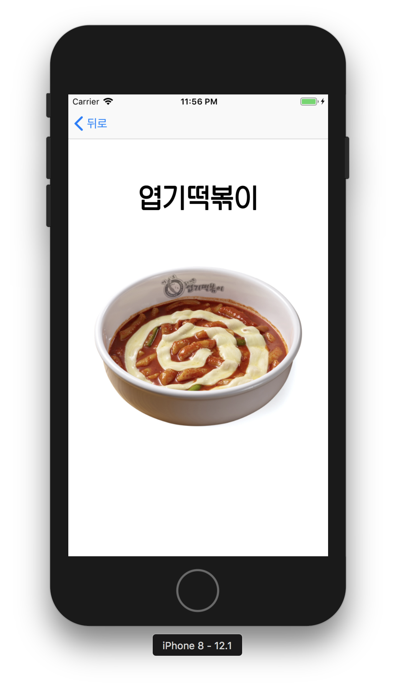

# What To Eat Today

> 화면 구성

- 기본화면
- 랜덤 메뉴 결과화면 (이미지가 없을 시 기본 이미지 출력)
- 메뉴 추가 화면 (Navigation bar button)

> 추가 기능

- 네트워크 Alamofire 라이브러리 사용
- textFieldShouldReturn으로 메뉴명 POST 
- locus_sangsang.otf 폰트 적용

> 실행 화면

